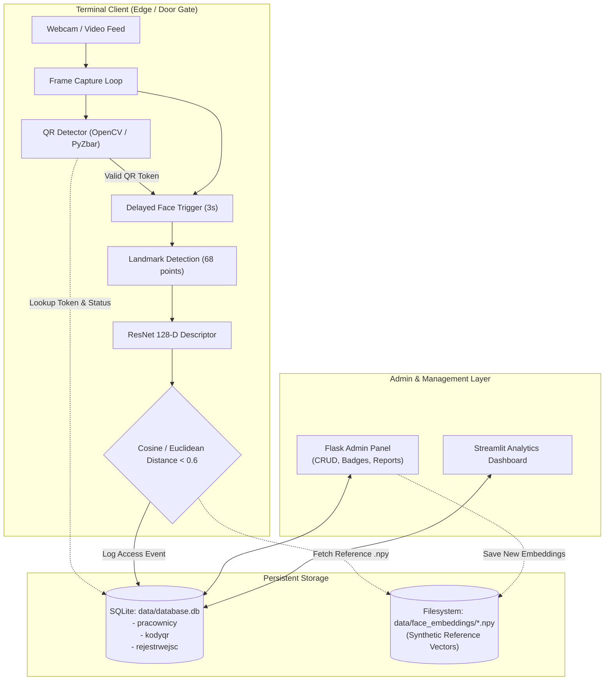

# Biometric Access Control System

A two-factor physical access control system combining QR code badge verification with real-time facial biometric recognition and centralized administrative management.

---

## Why this exists

Traditional physical access control methods—such as RFID keycards or static PIN codes—suffer from credential sharing, buddy punching, and physical theft. This project implements a two-factor authentication (2FA) paradigm for physical entry:
1. **Something you have**: A time-limited, encrypted QR badge assigned to an employee.
2. **Something you are**: Live facial biometric verification matching the badge holder against reference facial embeddings.

Both factors must validate before physical access is granted, and all access attempts (authorized or denied) are recorded in an audit trail for compliance and reporting.

---

## Architecture

The system consists of two primary subsystems sharing an SQLite data layer: the **Terminal Client** (running at the access door/gate) and the **Administrative Panel** (for security officers and HR).



### Data Flow
1. **Badge Presentation**: An individual presents a QR badge to the terminal webcam.
2. **Credential Validation**: The terminal queries `kodyqr` and `pracownicy` in SQLite to verify token validity, expiration, and employee authorization status.
3. **Biometric Verification**: If the badge is valid, the terminal captures face frames, extracts 68 facial landmarks via dlib, and computes a 128-dimensional embedding vector.
4. **Vector Distance Check**: The live descriptor is compared against the reference vector in `data/face_embeddings/*.npy`. If the Euclidean distance is within tolerance ($\le 0.6$), entry is granted (`WynikProbyEnum.Zezwolono`).
5. **Audit Logging**: Every entry attempt, timestamp, QR ID, matching distance, and status outcome is recorded in `rejestrwejsc`.

---

## Stack

- **Core Language**: Python 3.12+
- **Biometrics & Computer Vision**:
  - `dlib` (68-point facial landmark detector & ResNet-34 29-layer CNN face recognizer)
  - `OpenCV` (`cv2`) for frame acquisition, color-space transforms, and preprocessing
  - `numpy` for 128-D vector operations and distance metric calculations
- **QR Code Engine**: `qrcode`, `pyzbar`, `Pillow`
- **Web & Administration**:
  - `Flask` & `Flask-SQLAlchemy` (Web UI for employee enrollment, pass generation, and entry filtering)
  - `Streamlit` & `pandas` (interactive operational dashboard)
- **Terminal GUI**: `tkinter` with multi-threaded camera and recognition loop
- **Database**: SQLite with SQLAlchemy ORM
- **Testing**: `unittest` with mock fixtures for hardware and biometrics

---

## Running it

### 1. Prerequisites and Environment Setup

Clone the repository and set up a Python virtual environment:

```bash
git clone https://github.com/Mily063/Authentication_app.git
cd Authentication_app

python3 -m venv venv
source venv/bin/activate  # On Windows: venv\Scripts\activate
pip install -r requirements.txt
```

### 2. Download dlib Pre-trained Models

Download and decompress the required dlib landmark and recognition models as described in [models/README.md](file:///Users/mili0603/Documents/Studia/authorization_app/Authentication_app/models/README.md):

```bash
mkdir -p models
curl -L -O https://dlib.net/files/shape_predictor_68_face_landmarks.dat.bz2
curl -L -O https://dlib.net/files/dlib_face_recognition_resnet_model_v1.dat.bz2

bunzip2 shape_predictor_68_face_landmarks.dat.bz2
bunzip2 dlib_face_recognition_resnet_model_v1.dat.bz2
mv *.dat models/
```

### 3. Initialize & Seed Synthetic Demo Data

Generate a clean SQLite database schema and populate it with synthetic test employees, active QR tokens, and deterministic 128-D face embeddings (no camera or dlib models required):

```bash
python scripts/seed_demo_data.py
```

### 4. Run the Admin Panel

You can launch either the Flask web application or the Streamlit dashboard:

**Option A: Flask Web Management Console**
```bash
python admin_panel/app.py
```
Open [http://127.0.0.1:5000](http://127.0.0.1:5000) in your browser to manage employees, generate QR passes, and inspect access logs.

**Option B: Streamlit Operational Dashboard**
```bash
streamlit run admin_panel/streamlit_app.py
```

### 5. Run the Door Access Terminal

Ensure a webcam is connected, then launch the terminal GUI:

```bash
python terminal/main_terminal.py
```

### 6. Run Automated Tests

Execute the unit test suite (runs in-memory without requiring physical cameras or downloaded model binaries):

```bash
python -m unittest discover -s tests
```

---

## Team and my contribution

This project was built collaboratively by a team of three:

- **Miłosz Gibała**:
  - Architected initial project structure, SQLite relational schema (`admin_panel/models.py`, `admin_panel/db.py`), and system configuration (`config.py`).
  - Built the Flask administrative web application (`admin_panel/app.py`, `admin_panel/views.py`), Jinja2 templates, and CSS styling for employee management, status toggling, and QR badge issuance.
  - Implemented the Streamlit dashboard prototype (`admin_panel/streamlit_app.py`) and initial terminal integration logic (`terminal/qr_utils.py`, `terminal/face_utils.py`).
- **MichalWnek**:
  - Implemented the desktop terminal graphical interface (`terminal/main_terminal.py`) using Tkinter.
  - Resolved UI video feed freezing by refactoring frame acquisition and face processing into decoupled background worker threads.
  - Added Windows platform support and integrated dlib model inference pipelines with `requirements.txt`.
- **wiedzmok (Paweł Barnaś)**:
  - Authored the comprehensive unit test suite (`tests/test_admin_panel.py`) covering employee CRUD, QR code generation, access reporting, and edge cases.
  - Built test doubles/mock stubs for dlib and QR hardware to enable headless CI/CD testing without physical devices.
  - Maintained code hygiene, pycache cleanup, and branch merges.

---

## Privacy note

Facial embeddings and user database records are not versioned in this repository; the codebase contains only a synthetic demo data generator to ensure strict biometric privacy and compliance.

---

## What I'd do differently

1. **Dedicated Vector Store & Biometric Encryption**: Instead of saving loose `.npy` files referenced by filesystem paths in SQLite, use an embedded vector database (e.g., SQLite-VSS, FAISS, or Chroma) and encrypt biometric templates at rest using AES-256-GCM. Filesystem paths are brittle across deployment environments and lack data protection.
2. **Decouple Edge Terminal from Backend via gRPC/REST**: The terminal client currently imports Flask application modules directly and shares local SQLite database files, causing potential concurrency locks. A production system should separate the gate terminal into an edge client communicating with a centralized backend over TLS-authenticated gRPC or REST APIs.
3. **Liveness & Anti-Spoofing Verification**: The current facial matching evaluates 2D video frames against static descriptors without liveness detection. Implementing passive texture analysis, 3D depth sensing, or active challenge-response protocols (e.g., blink or head-turn detection) is essential to mitigate print and digital replay spoof attacks.
